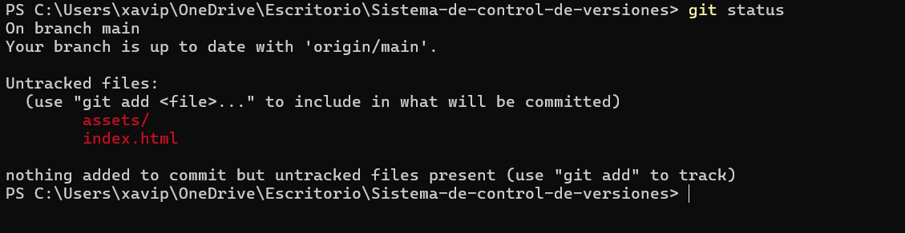

# 📘 Documento Único de la Práctica — Git + Git Flow + Projects + GitHub Pages

> Proyecto de ejemplo con 3 usuarios simulados, flujo Git Flow completo (features, release y hotfix),
> tablero de GitHub Projects, documentación en gh-pages y buenas prácticas de commits.

---

## 🧭 Índice
1. [Usuarios simulados](#-usuarios-simulados)
2. [Prerrequisitos](#-prerrequisitos)
3. [Creación y subida del repositorio](#-creación-y-subida-del-repositorio)
4. [Inicializar Git Flow](#-inicializar-git-flow)
5. [Usuario 1 — Estructura base](#-usuario-1--estructura-base)
6. [Usuario 2 — Features de contenido y atributos](#-usuario-2--features-de-contenido-y-atributos)
7. [Usuario 3 — Feature estilos CSS](#-usuario-3--feature-estilos-css)
8. [Release v1.0](#-release-v10)
9. [Hotfix millores v1_0](#-hotfix-millores-v_1_0)
10. [GitHub Project (Board/Canvas)](#-github-project-boardcanvas)
11. [Documentación en GitHub Pages (gh-pages)](#-documentación-en-github-pages-gh-pages)
12. [Colaborador requerido](#-colaborador-requerido)
13. [Buenas prácticas de commits](#-buenas-prácticas-de-commits)
14. [Checklist de entrega](#-checklist-de-entrega)
15. [Plantillas de Issues y PRs](#-plantillas-de-issues-y-prs)
16. [Solución de problemas habituales](#-solución-de-problemas-habituales)
17. [Resumen de comandos (chuleta)](#-resumen-de-comandos-chuleta)
18. [Capturas sugeridas](#-capturas-sugeridas)

---

## 👥 Usuarios simulados
- **Usuario 1**: estructura inicial del proyecto y **hotfix**.
- **Usuario 2**: **feature/contingutHTML** y **feature/atributsHTML**.
- **Usuario 3**: **feature/estilsCSS** y **release v1.0**.

```markdown

```

Crear archivo 
index.html
assets/styles.css
assets/script.js


```markdown

```

Realizar el commit y el push.
Para insertar una imagen en Markdown, usa la siguiente sintaxis:

```markdown

```

git checkout develop
git add .
git commit -m "Usuario1: estructura inicial con Home, nav y footer

## Creamos el gitflow


```markdown

```


git push origin develop

