# 📘 Documento Único de la Práctica — Git + Git Flow + Projects + GitHub Pages

> Proyecto de ejemplo con 3 usuarios simulados, flujo Git Flow completo (features, release y hotfix),
> tablero de GitHub Projects, documentación en gh-pages y buenas prácticas de commits.

---

## 🧭 Índice
1. [Usuarios simulados](#-usuarios-simulados)
2. [Prerrequisitos](#-prerrequisitos)
3. [Creación y subida del repositorio](#-creación-y-subida-del-repositorio)
4. [Inicializar Git Flow](#-inicializar-git-flow)
5. [Usuario 1 — Estructura base](#-usuario-1--estructura-base)
6. [Usuario 2 — Features de contenido y atributos](#-usuario-2--features-de-contenido-y-atributos)
7. [Usuario 3 — Feature estilos CSS](#-usuario-3--feature-estilos-css)
8. [Release v1.0](#-release-v10)
9. [Hotfix millores v1_0](#-hotfix-millores-v_1_0)
10. [GitHub Project (Board/Canvas)](#-github-project-boardcanvas)
11. [Documentación en GitHub Pages (gh-pages)](#-documentación-en-github-pages-gh-pages)
12. [Colaborador requerido](#-colaborador-requerido)
13. [Resumen de comandos (chuleta)](#-resumen-de-comandos-chuleta)

---

## 👥 Usuarios simulados
- **Usuario 1**: estructura inicial del proyecto y **hotfix**.
- **Usuario 2**: **feature/contingutHTML** y **feature/atributsHTML**.
- **Usuario 3**: **feature/estilsCSS** y **release v1.0**.

---

## 🧰 Prerrequisitos
- Cuenta en GitHub.
- Git instalado.
- Editor (VS Code).
- (Recomendado) Repo público para habilitar GitHub Pages.

---

## 🏁 Creación y subida del repositorio

### 1 Crear repo vacío en GitHub (sin README) → copiar URL HTTPS

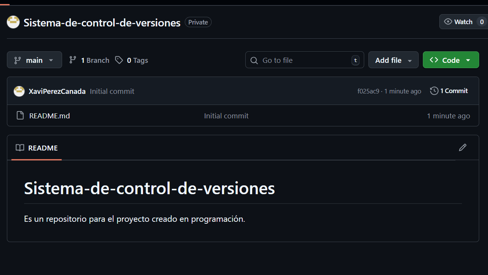

Crear archivo 
index.html
assets/styles.css
assets/script.js

###  Clonar o iniciar localmente

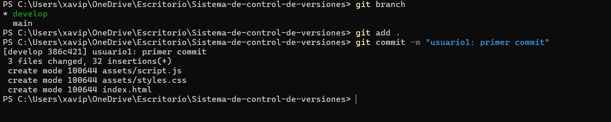 

https://github.com/XaviPerezCanada/Sistema-de-control-de-versiones.git

Podemos pulsar el boton verde '<code>' y empezar la clonación.

## Inicializar Git Flow

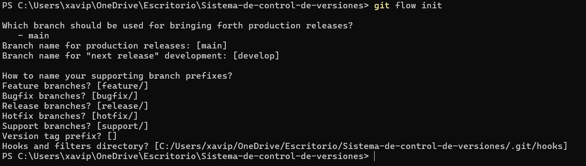

git push origin develop

Realizar el commit y el push.

## Usuario 1 — Estructura base

Realizamos un clone, para empezar a trabajar en local, una vez clonado realizamos un commit para sincronizar todo bien.

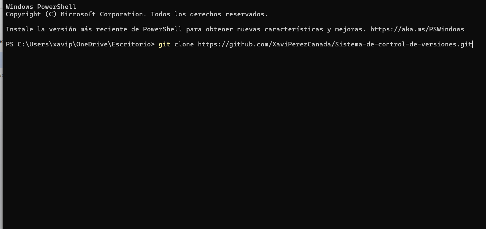

git checkout develop
git add .
git commit -m "Usuario1: primer commit"

## Usuario 2 — Features de contenido y atributos

git flow feature start contingutHTML

Una vez creada la rama, nos moverá directamente, es de buena práctica comprobar en un git branch o git status si estamos trabajando correctamente.

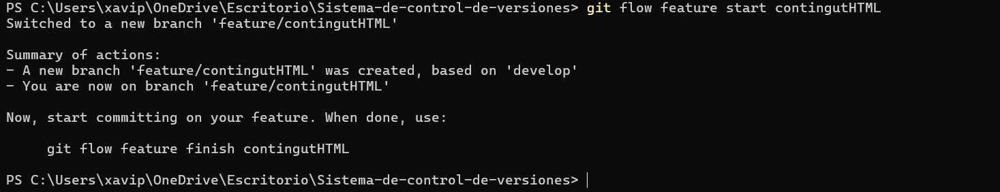

git add .
git commit -m "usuario2: indicamos lo midificado"

Para poder ver luego bien gráficamente los features en flow, es interesante realizar al menos 2 commits por feature

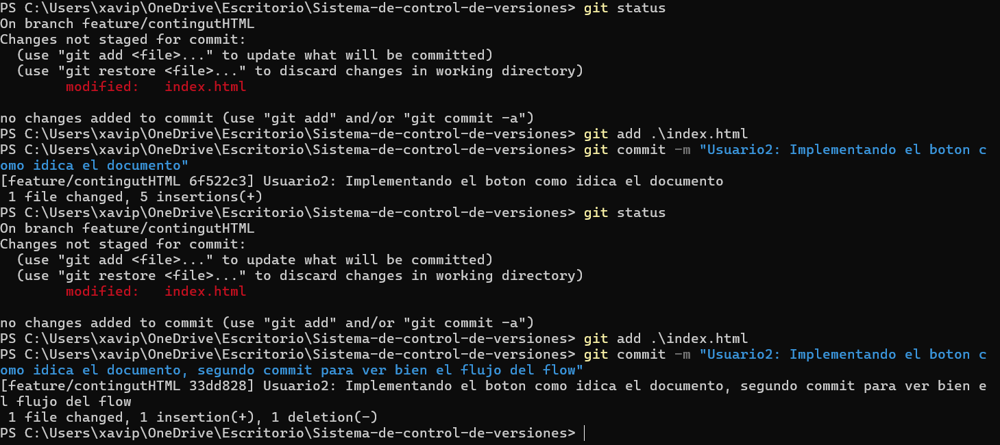

Usuario: Usuario 2"

git commit -m "Usuario: Usuario 2" Implementando el boton C como indica el documento"

Usuario: Usuario 2"

git flow feature finish contingutHTML

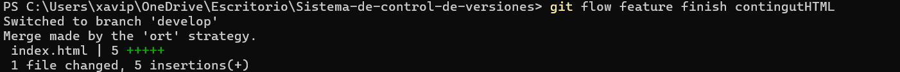

Si quisieramos subirlo al remoto hariamos el git push, si estamos trabajando en local, no es necesario.

git push origin develop

# Atributos HTML Usuario 2

git flow feature start atributsHTML

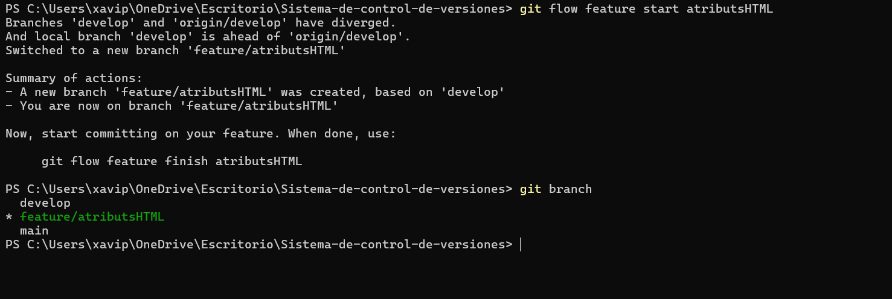

Aplicamos los atributos HTML a los botones, y al javascript para recoger bien los datos del HTML.
Una vez realizados los cambios, procedemos a actualizar el repositorio local con los siguientes commandos.

git add .
git commit -m "Usuario2: sección 'Modificar atributos HTML'

Comprobamos siempre los cambios:

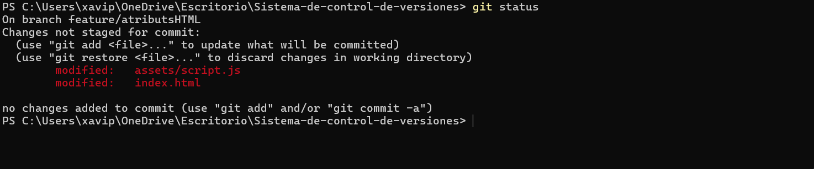

Y los añadimos i comiteamos.

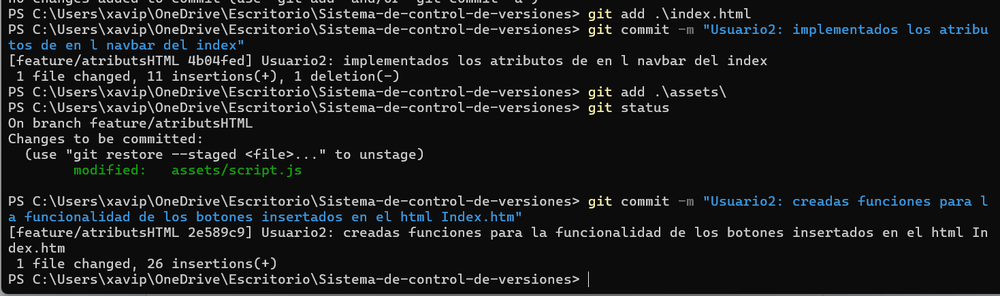

Usuario: Usuario 2"
git flow feature finish atributsHTML
git push origin develop

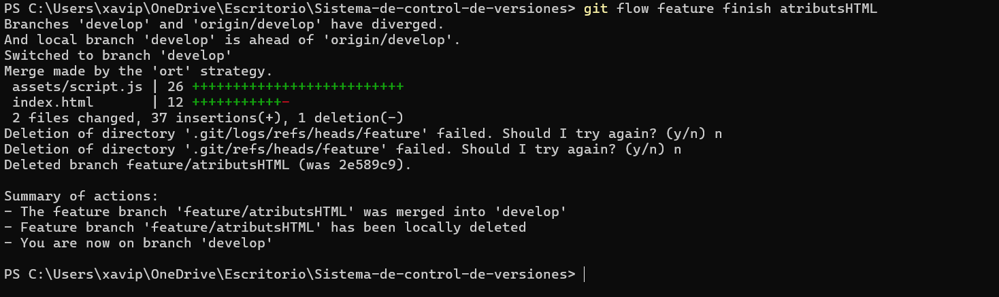

## Usuario 3 — Feature estilos CSS

git flow feature start estilsCSS

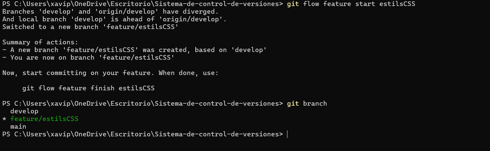

### ... editar index.html, styles.css y script.js (toggle clase, estilos inline) ...

git add .
git commit -m "Usuario3 : sección 'Modificar estils CSS' con ejemplos

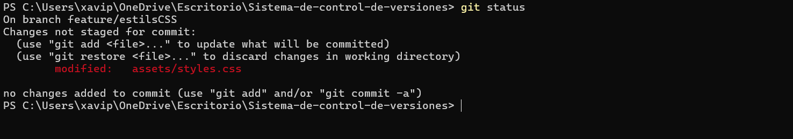

Usuario: Usuario 3"
git commit  -m "Usuario 3: segundo commit ilustrativo

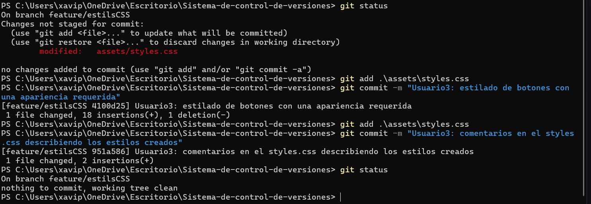

Usuario: Usuario 3"
git flow feature finish estilsCSS

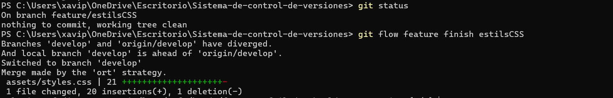

Si hacemos un git log --graph --online -- decorate develop 
podemos ver el trabajo realziado desde la terminal.

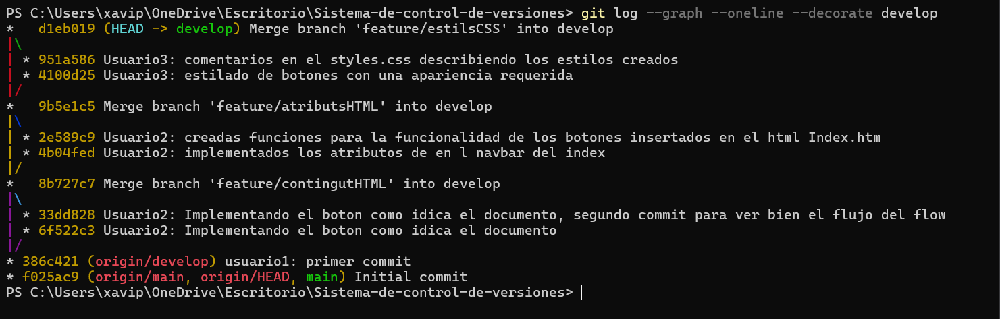

## Release v1.0

git flow release start v1.0
### ... ajustes finales (texto de versión en index/README) ...
git commit -am "Usuario 3 : preparar v1.0

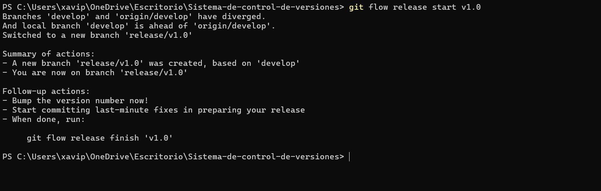

Usuario: Usuario 3"
git flow release finish v1.0

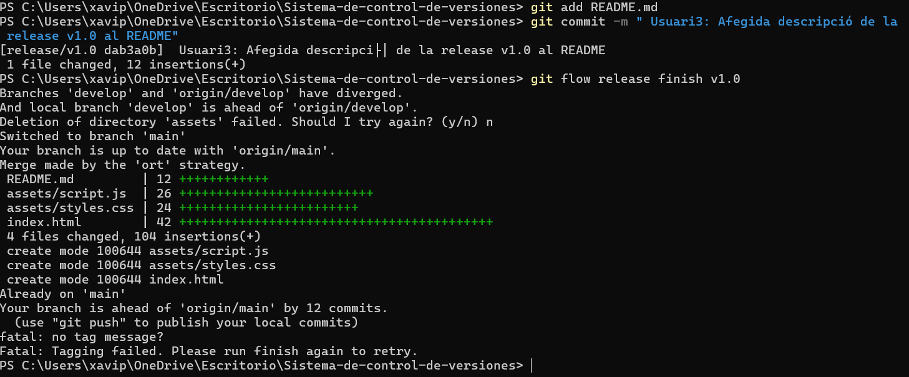

git push origin main develop --tags si se quiere subir al remoto.

## Hotfix millores v1_0

git flow hotfix start milloresV_1_0
### ... pequeña mejora (UX o copy) en la sección contenido ...
git commit -am "fUsuario1: mejora UX tras v1.0

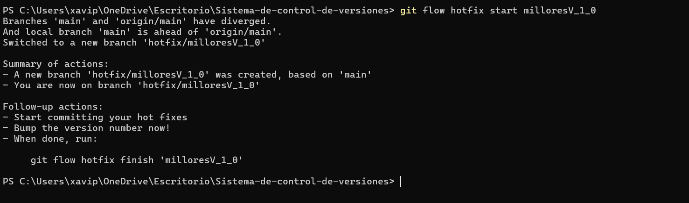

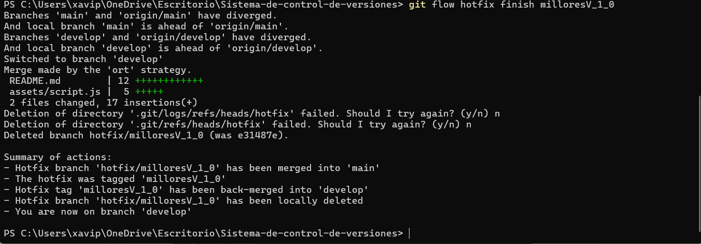

Usuario: Usuario 1"
git flow hotfix finish milloresV_1_0
git push origin main develop --tags

## GitHub Project (Board/Canvas)

En el repo → Projects → New project → plantilla Board.

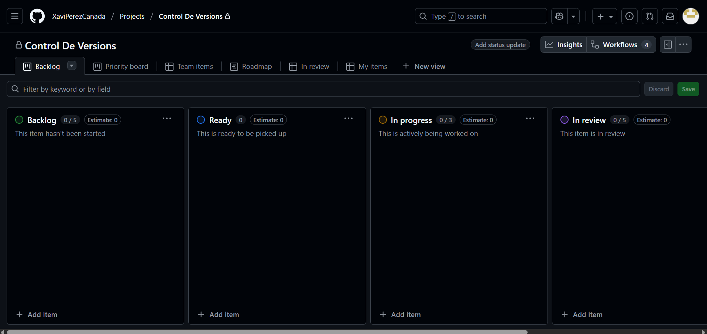

Crear Issues:

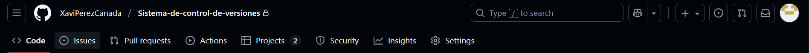

Feature: Modificar contenido HTML (label feature)

Feature: Modificar atributos HTML (label feature)

Feature: Modificar estils CSS (label feature)

Hotfix: millores v1.0 (label hotfix)

Asignar milestone v1.0 (a features y hotfix).

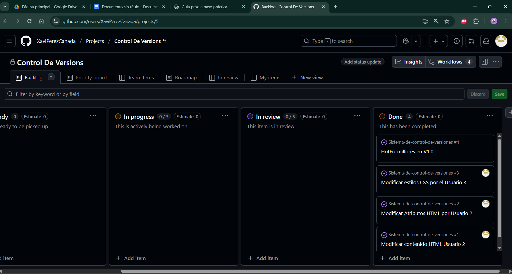

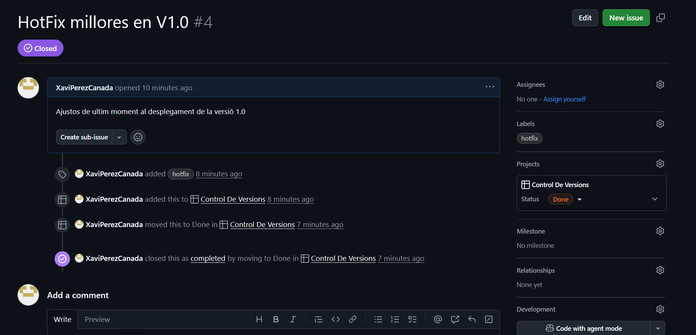

## Documentación en GitHub Pages (gh-pages)

git checkout --orphan gh-pages
git rm -rf .

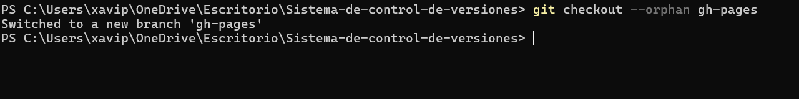 

### Crear index.md con este documento u otro
"# Documentación del Proyecto" | Out-File -Encoding UTF8 index.md

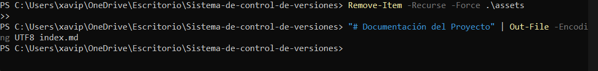 

git add .
git commit -m "docs: documentación inicial gh-pages

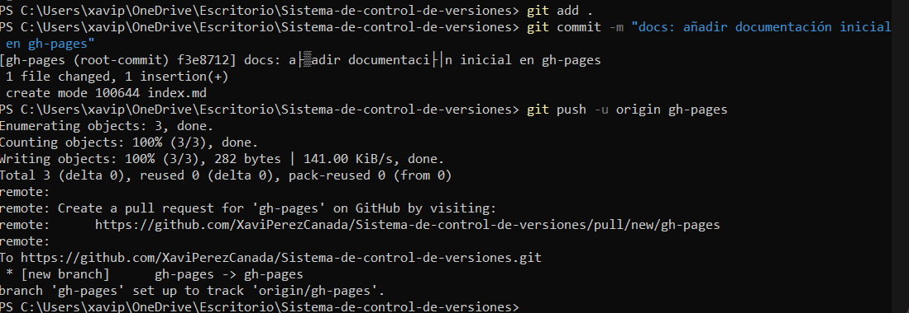 

Usuario: Usuario 1"
git push -u origin gh-pages

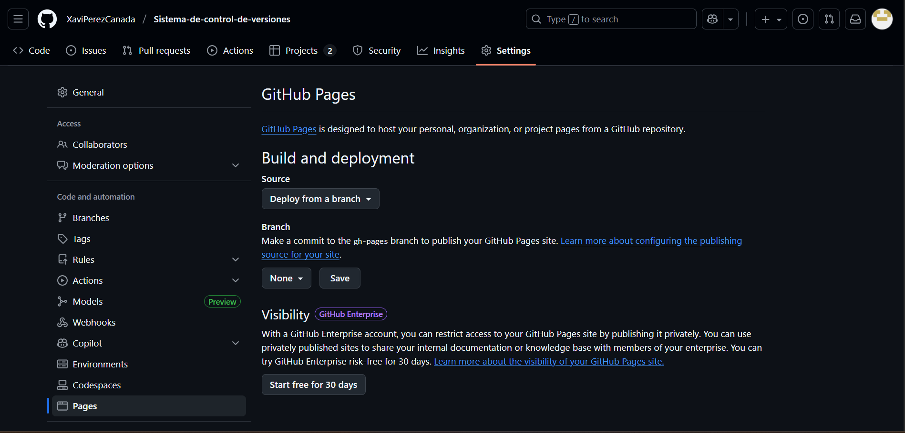 

El repositorio tiene que ser píblico, en la imagen estamos en uno privado.

Activar Pages

Repo → Settings → Pages

Build and deployment → Source: Deploy from a branch

Branch: gh-pages — Folder: / (root)

Guardar → esperar 1–3 min → URL tipo:

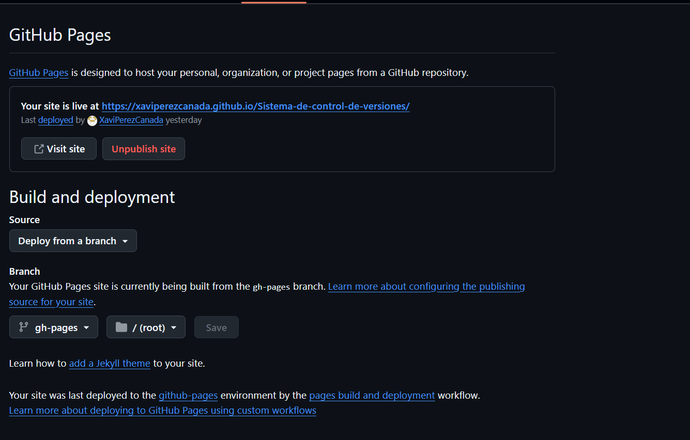 

## Colaborador requerido

👤 Colaborador requerido

Repo → Settings → Collaborators and teams → Add people

Invitar a antoni-gimenez.

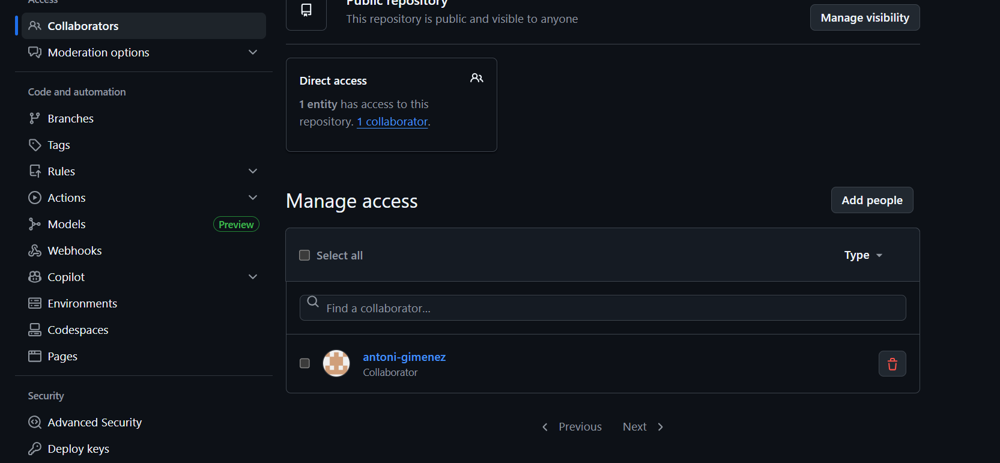 

## Resumen de comandos (chuleta)

### Inicial
git flow init

### Features
git flow feature start contingutHTML
git add .
git commit -m "feat(contenido): ...\n\nUsuario: Usuario 2"
git flow feature finish contingutHTML

git flow feature start atributsHTML
git commit -m "feat(atributos): ...\n\nUsuario: Usuario 2"
git flow feature finish atributsHTML

git flow feature start estilsCSS
git commit -m "feat(estilos): ...\n\nUsuario: Usuario 3"
git flow feature finish estilsCSS

# Release
git flow release start v1.0
git commit -am "chore(release): preparar v1.0\n\nUsuario: Usuario 3"
git flow release finish v1.0
git push origin main develop --tags

# Hotfix
git flow hotfix start milloresV_1_0
git commit -am "fix(contenido): ...\n\nUsuario: Usuario 1"
git flow hotfix finish milloresV_1_0
git push origin main develop --tags

# Publicarlo todo
git push origin --all
git push origin --tags

